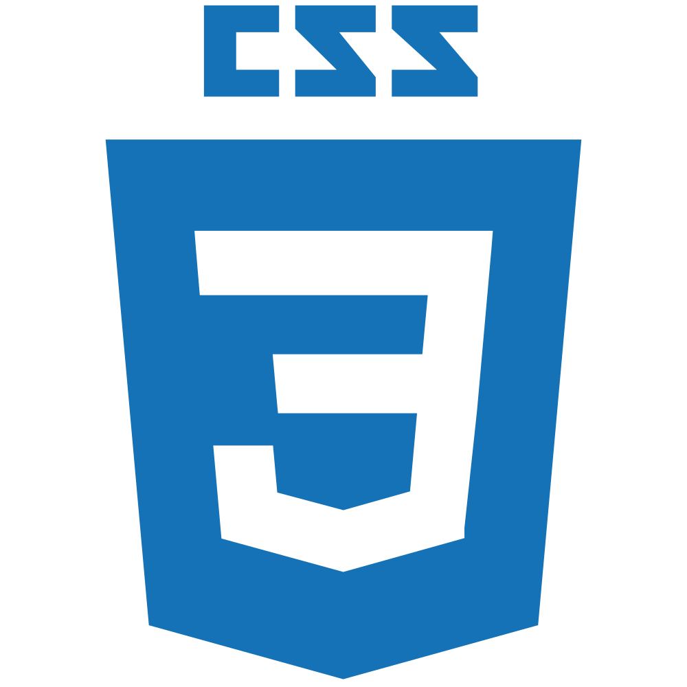

# 📞 iChat

iChat is a real time chat application that supports private chats

# Documentation

The documentation for iChat can be viewed [here](iamkhattar.github.io/iChat)

# Installation

## Setup

Create a file called _keys.js_ under _/config_. Export a MongoURI and a Secret token for JWT Encryption from this file.

The _keys.js_ file should look like this:

```javascript
module.exports = {
  mongoURI: "mongo-uri-goes-here",
  secrettoken: "secret-token-goes-here",
};
```

## Installing Server Dependencies

The server requires additional dependencies to be installed on the system to function as intended. To install these dependencies, use the following command in the root directory

```bash
  npm install
```

## Installing Client Dependencies

The client requires additional dependencies to be installed on the system to function as intended. To install these dependencies, use the following command in the client directory.
To navigate to the client directory use the following command:

```bash
  cd client
```

Once in the client directory, use the following command to install the required dependencies:

```bash
  npm install
```

# Running the Application

To run the application in developer mode, use the following command:

```bash
  npm run dev
```

The application will refresh automatically if any changes are made to the code in Devloper Mode

# Technology Stack

## Client

    

## Server

   

## Development

  

# Application

|  |  |  |
| ------------------------------- | :--------------------------: | ------------------------------------: |


# Contributors

<a href="https://github.com/iamkhattar"></a> <a href="https://github.com/kalqallaf"></a>

# License

MIT
